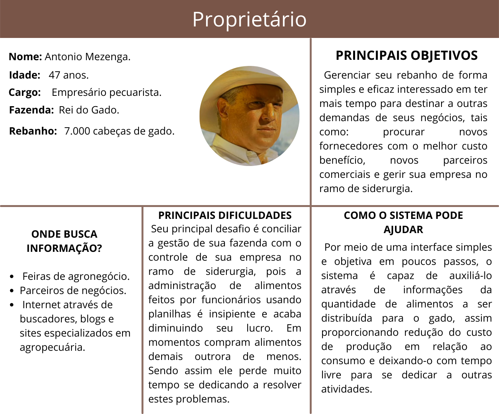
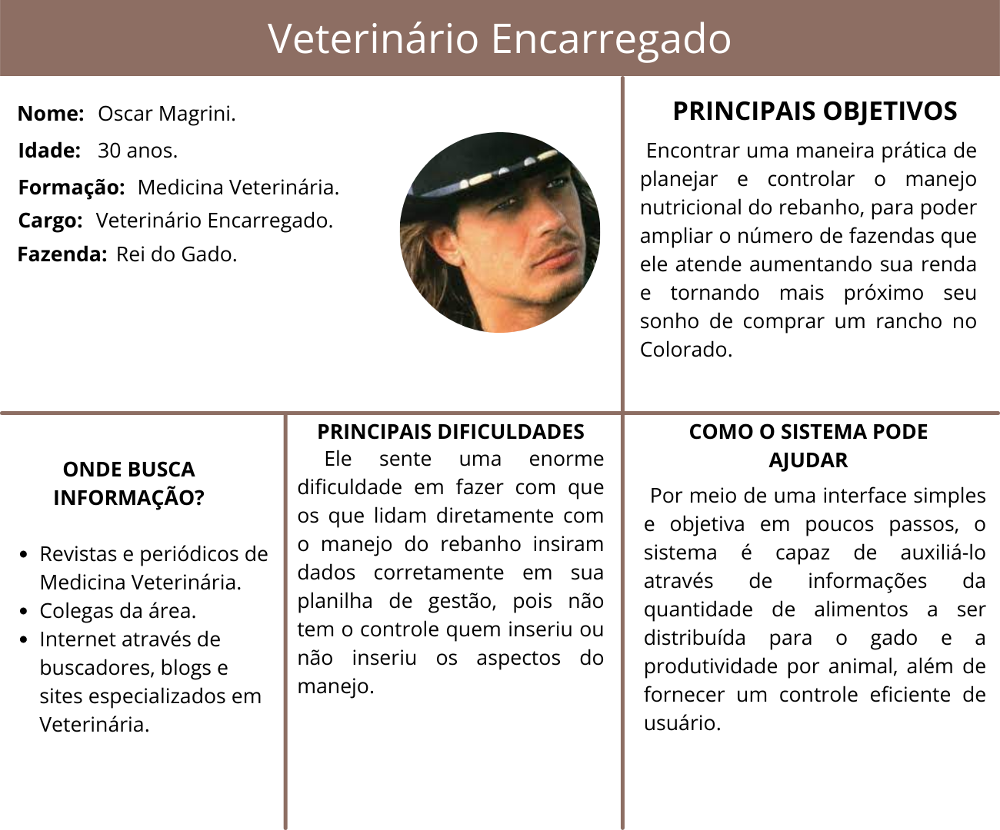
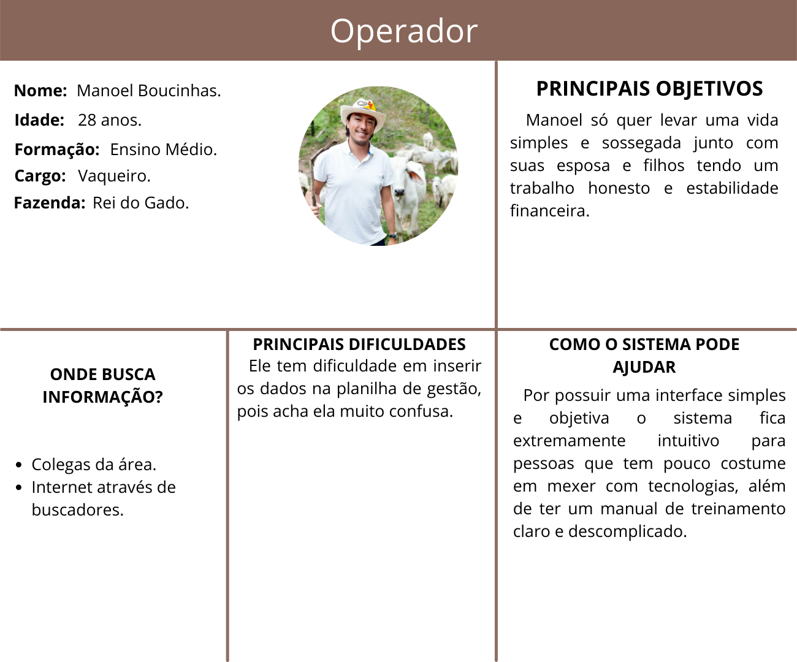

# Especificações do Projeto

Definição do problema e ideia de solução a partir da perspectiva do usuário. É composta pela definição do  diagrama de personas, histórias de usuários, requisitos funcionais e não funcionais além das restrições do projeto.

Apresente uma visão geral do que será abordado nesta parte do documento, enumerando as técnicas e/ou ferramentas utilizadas para realizar a especificações do projeto

## Personas

A fim de compreender melhor o perfil dos clientes ideais que nosso sistema web almeja, foi elaborado o buyer persona de cada um das categorias encontradas no público-alvo, como podemos observar nas imagens abaixo.

## Histórias de Usuários

Com base na análise das personas foram identificadas as seguintes histórias de usuários:

|EU COMO... `PERSONA`| QUERO/PRECISO ... `FUNCIONALIDADE`  |PARA ... `MOTIVO/VALOR`                 |
|--------------------|-------------------------------------|----------------------------------------|
| Proprietário | Relatório de controle financeiro lucro/perdas| Gerenciar o negócio com mais facilidade e eficácia.
| Proprietário | Controle eficiente de usuário| Verificar quem está cumprindo com as devidas tarefas.
| Proprietário | Selecionar a estratégia adequada para meu tipo de fazenda | Obter maior lucratividade e eficiência 
|Veterinário Encarregado| Informações sobre a quantidade de alimentos volumosos e concentrados no estoque| Formular a melhor combinação de ração
|Veterinário Encarregado| Relatório de ganho de peso dos animais| Saber se o animal se encontra na idade correta e peso adequado para abate
|Veterinário Encarregado| Informações referente a raça, peso vivo, idade, sexo e taxa de ganho em peso esperado quando pesquisar pela ID do animal|Saber se o animal vai atingir as exigências nutricionais no período previsto
|Veterinário Encarregado|Comparação entre uma dieta com maior teor de alimentos concentrados em relação a volumosos|Apresentar a melhor conversão alimentar para determinada época do ano
|Veterinário Encarregado|Qualidade, validade e quantidade dos alimentos que serão distribuídos|Formulação da ração com o menor custo e máximo desempenho possível
|Veterinário Encarregado|Relatório que apresente desempenho do animal com dieta x e y|Descobrir a melhor dieta para cada grupo do rebanho
|Veterinário Encarregado|Relação entre a nutrição e bem-estar animal|Obter os melhores indicadores para realizar futuras aplicações de determinada dieta
|Operador 1          | Conferir a quantidade de insumos  no estoque   | Manter o estoque com quantidade adequada| 
|Operador 1          | Registrar os fornecedores de insumos| Obter insumos de menor custo, maior qualidade e entrega dentro do prazo |
|Operador 2          | Gerar cálculo da quantidade de insumos necessários por animal | Diminuir perdas de ração e suplemento alimentar|
|Operador 2          | Acessar o resultado do cálculo alimentar por animal | Alimentar o animal de acordo com as suas necessidades nutricionais | 
|Operador 3          | Documentar frequência de alimentação e quantidade de insumos consumidos |  Acompanhar a evolução do ganho ou perda de peso do animal |
|Operador 3          | Acessar as informações necessárias sobre condição geral do animal | Definir o melhor momento para o abate |
|Operador 4          | Atualizar cadastro do animal | Registrar novos animais ou dar baixa de animais no sistema | 
|Administrador       | Alterar permissões                  | Permitir que possam administrar contas |

Apresente aqui as histórias de usuário que são relevantes para o projeto de sua solução. As Histórias de Usuário consistem em uma ferramenta poderosa para a compreensão e elicitação dos requisitos funcionais e não funcionais da sua aplicação. Se possível, agrupe as histórias de usuário por contexto, para facilitar consultas recorrentes à essa parte do documento.

> **Links Úteis**:
> - [Histórias de usuários com exemplos e template](https://www.atlassian.com/br/agile/project-management/user-stories)
> - [Como escrever boas histórias de usuário (User Stories)](https://medium.com/vertice/como-escrever-boas-users-stories-hist%C3%B3rias-de-usu%C3%A1rios-b29c75043fac)
> - [User Stories: requisitos que humanos entendem](https://www.luiztools.com.br/post/user-stories-descricao-de-requisitos-que-humanos-entendem/)
> - [Histórias de Usuários: mais exemplos](https://www.reqview.com/doc/user-stories-example.html)
> - [9 Common User Story Mistakes](https://airfocus.com/blog/user-story-mistakes/)

## Requisitos

As tabelas que se seguem apresentam os requisitos funcionais e não funcionais que detalham o escopo do projeto.

### Requisitos Funcionais

|ID    | Descrição do Requisito  | Prioridade |
|------|-----------------------------------------|----|
|RF-001| Permitir que o usuário master (Proprietário) cadastre seus colaboradores | ALTA | 
|RF-002| Emitir um relatório de lucro/perdas   | MÉDIA |
|RF-003| Permitir que o operador 1 cadastre estoque de ração e suplemento alimentar| ALTA|
|RF-004| Permitir que o operador 1 cadastre informação sobre data de validade dos lotes de ração e suplemento alimentar| MÉDIA |
|RF-005| Permitir que o operador 1 cadastre informações sobre fornecedores de ração e suplemento alimentar| BAIXA |
|RF-006| Permitir que o operador 2 gere cálculos | Alta|
|RF-007| Permitir que o operador 3 cadastre no sistema a frequência e a quantidade de insumos consumidos| ALTA |
|RF-008| Permitir que o operador 3 acesse relatórios sobre condição geral do animal | MÉDIA |
|RF-009| Permitir que o veterinário encarregado cadastre informações sobre as dietas| ALTA |
|RF-010| Permitir que o veterinário encarregado obtenha um relatório sobre a nutrição do animal | ALTA |
|RF-011| Emitir um relatório de controle financeiro | MÉDIA
|RF-012| Permitir que o veterinário encarregado obtenha relatório da quantidade de alimentos MS (Matéria Seca)| ALTA |
|RF-013| Permitir que o veterinário encarregado obtenha um relatório de ganho de peso dos animais | ALTA |
|RF-014| Permitir que o veterinário encarregado obtenha informações detalhadas do animal quando pesquisar pela sua ID | ALTA |
|RF-015| Permitir que o veterinário encarregado obtenha um comparativo entre uma dieta com maior teor de concentrados em relação aos volumosos | ALTA |
|RF-016| Emitir um relatório de dos registros realizados pelos usuários no sistema | MÉDIA |
|RF-017| Permitir que usuário Administrador possa gerenciar permissões dos outros usuários | MÉDIA |

### Requisitos não Funcionais

|ID     | Descrição do Requisito  |Prioridade |
|-------|-------------------------|----|
|RNF-001| O sistema deve ser responsivo para rodar em um dispositivo móvel | MÉDIA | 
|RNF-002| Deve processar requisições do usuário em no máximo 3s |  BAIXA | 
|RNF-003| O sistema deve calcular por quanto tempo o estoque de ração e suplemento alimentar irá durar |  ALTA |
|RNF-004| O sistema deve informar ao usuário que o estoque de ração e suplemento alimentar está baixo |  MÉDIA | 
|RNF-005| O sistema deve informar quantas vezes o animal se alimenta por dia |  ALTA |
|RNF-006| O sistema deve calcular quantidade de alimento consumido pelo animal por dia |  MÉDIA | 
|RNF-007| O sistema deve mostrar a(s) dieta(s) disponíveis para um animal específico |  ALTA |
|RNF-008| O sistema deve  mostrar se o animal está com um bom nível de nutrição |  MÉDIA | 
|RNF-009| O sistema deve permitir o registro de informações mesmo offline | MÉDIA |
|RNF-010| O sistema deve apresentar a melhor combinação de ração | MÉDIA |
|RNF-011| O sistema deve apresentar as informações de cada animal através de sua ID | ALTA |
|RNF-012| O sistema deve apresentar um relatório de ganho de peso dos animais | MÉDIA |
|RNF-013| O sistema deve apresentar uma dieta adequada para determinada época do ano | BAIXA |
|RNF-014| O sistema deve apresentar a dieta ideal para cada grupo do rebanho | MÉDIA |
|RNF-015| O sistema deve apresentar o valor que será gasto ao escolher uma dieta específica | MÉDIA |
|RNF-016| O sistema deve adotar adotar recomendações para acessibilidade de seu conteúdo | BAIXA |
|RNF-017| O sistema deve possibilitar visualização em Alto Contraste | BAIXA |
|RNF-018| O sistema deve acessar e armazenar dados em um banco NoSQL | MÉDIA |

Com base nas Histórias de Usuário, enumere os requisitos da sua solução. Classifique esses requisitos em dois grupos:

- [Requisitos Funcionais
 (RF)](https://pt.wikipedia.org/wiki/Requisito_funcional):
 correspondem a uma funcionalidade que deve estar presente na
  plataforma (ex: cadastro de usuário).
- [Requisitos Não Funcionais
  (RNF)](https://pt.wikipedia.org/wiki/Requisito_n%C3%A3o_funcional):
  correspondem a uma característica técnica, seja de usabilidade,
  desempenho, confiabilidade, segurança ou outro (ex: suporte a
  dispositivos iOS e Android).
Lembre-se que cada requisito deve corresponder à uma e somente uma
característica alvo da sua solução. Além disso, certifique-se de que
todos os aspectos capturados nas Histórias de Usuário foram cobertos.

## Restrições

O projeto está restrito pelos itens apresentados na tabela a seguir.

|ID| Restrição                                             |
|--|-------------------------------------------------------|
|01| O projeto deverá ser entregue até o final do semestre |
|02| Não pode ser desenvolvido um módulo de backend        |

Enumere as restrições à sua solução. Lembre-se de que as restrições geralmente limitam a solução candidata.

> **Links Úteis**:
> - [O que são Requisitos Funcionais e Requisitos Não Funcionais?](https://codificar.com.br/requisitos-funcionais-nao-funcionais/)
> - [O que são requisitos funcionais e requisitos não funcionais?](https://analisederequisitos.com.br/requisitos-funcionais-e-requisitos-nao-funcionais-o-que-sao/)
